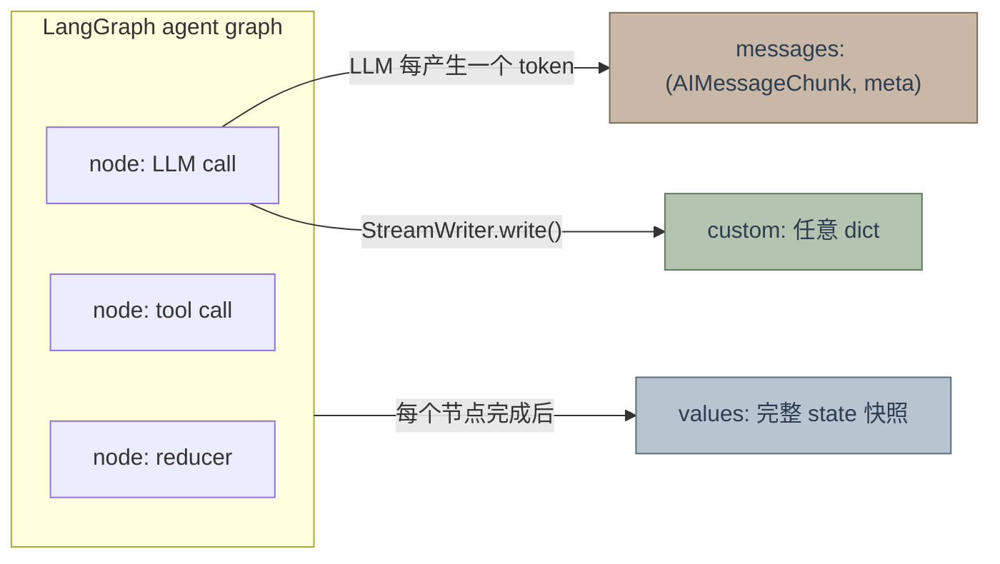
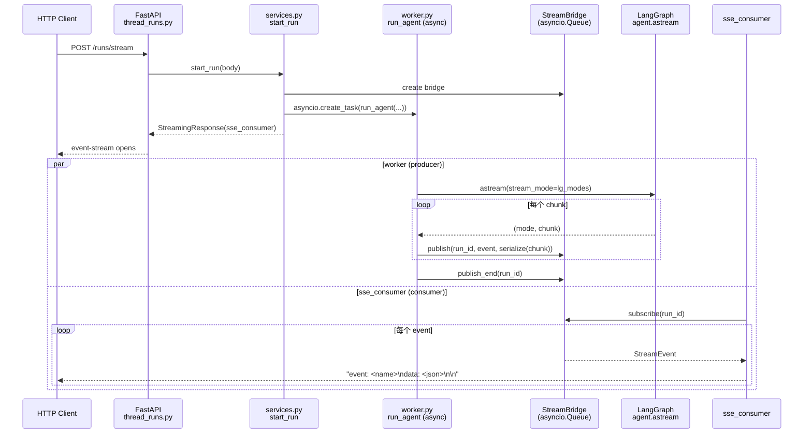
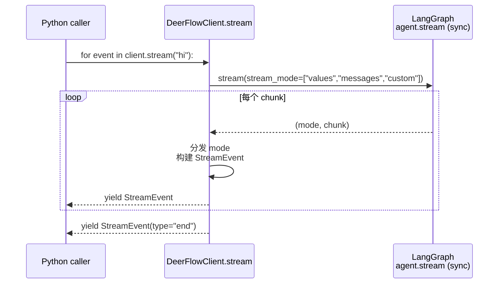
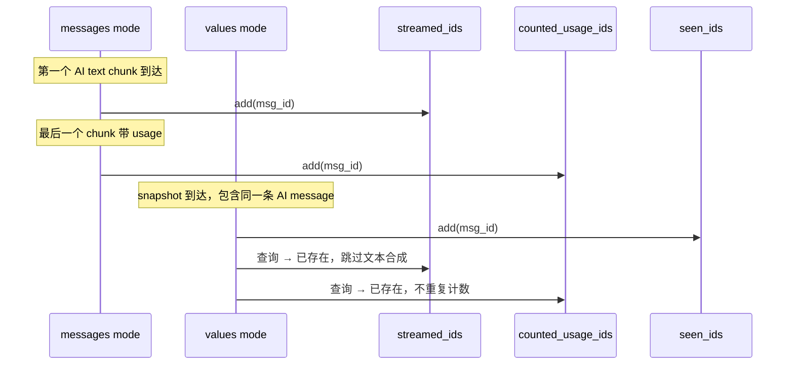
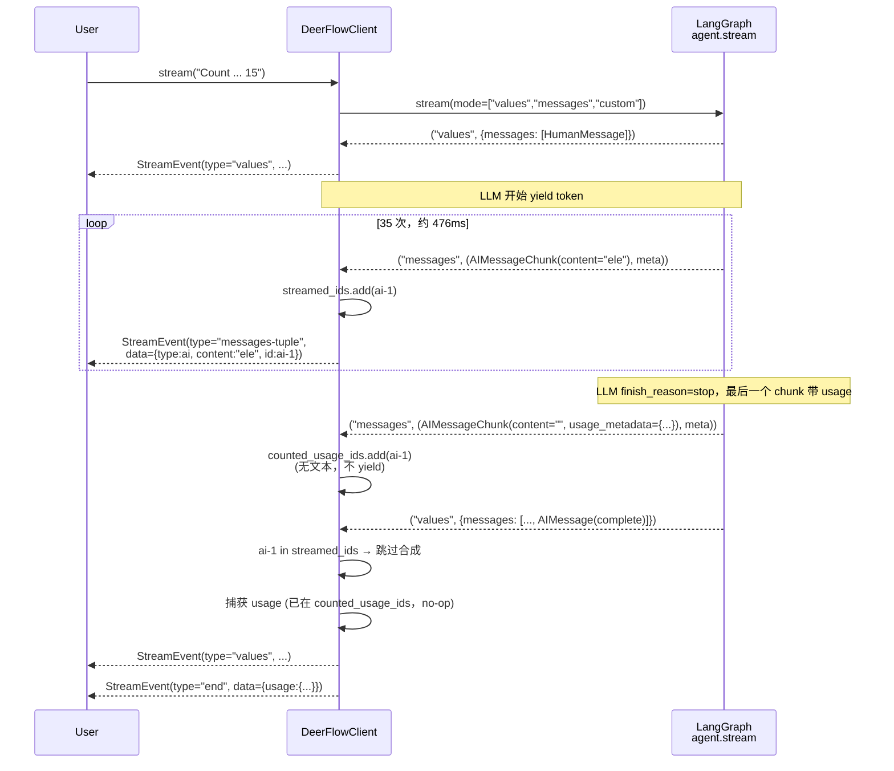

# DeerFlow 流式输出设计

本文档解释 DeerFlow 是如何把 LangGraph agent 的事件流端到端送到两类消费者（HTTP 客户端、嵌入式 Python 调用方）的：两条路径为什么**必须**并存、它们各自的契约是什么、以及设计里那些 non-obvious 的不变式。

---

## TL;DR

- DeerFlow 有**两条并行**的流式路径：**Gateway 路径**（async / HTTP SSE / JSON 序列化）服务浏览器和 IM 渠道；**DeerFlowClient 路径**（sync / in-process / 原生 LangChain 对象）服务 Jupyter、脚本、测试。它们**无法合并**——消费者模型不同。
- 两条路径都从 `create_agent()` 工厂出发，核心都是订阅 LangGraph 的 `stream_mode=["values", "messages", "custom"]`。`values` 是节点级 state 快照，`messages` 是 LLM token 级 delta，`custom` 是显式 `StreamWriter` 事件。**这三种模式不是详细程度的梯度，是三个独立的事件源**，要 token 流就必须显式订阅 `messages`。
- 嵌入式 client 为每个 `stream()` 调用维护三个 `set[str]`：`seen_ids` / `streamed_ids` / `counted_usage_ids`。三者看起来相似但管理**三个独立的不变式**，不能合并。

---

## 为什么有两条流式路径

两条路径服务的消费者模型根本不同：

| 维度 | Gateway 路径 | DeerFlowClient 路径 |
|---|---|---|
| 入口 | FastAPI `/runs/stream` endpoint | `DeerFlowClient.stream(message)` |
| 触发层 | `runtime/runs/worker.py::run_agent` | `packages/harness/deerflow/client.py::DeerFlowClient.stream` |
| 执行模型 | `async def` + `agent.astream()` | sync generator + `agent.stream()` |
| 事件传输 | `StreamBridge`（asyncio Queue）+ `sse_consumer` | 直接 `yield` |
| 序列化 | `serialize(chunk)` → 纯 JSON dict，匹配 LangGraph Platform wire 格式 | `StreamEvent.data`，携带原生 LangChain 对象 |
| 消费者 | 前端 `useStream` React hook、飞书/Slack/Telegram channel、LangGraph SDK 客户端 | Jupyter notebook、集成测试、内部 Python 脚本 |
| 生命周期管理 | `RunManager`：run_id 跟踪、disconnect 语义、multitask 策略、heartbeat | 无；函数返回即结束 |
| 断连恢复 | `Last-Event-ID` SSE 重连 | 无需要 |

**两条路径的存在是 DRY 的刻意妥协**：Gateway 的全部基础设施（async + Queue + JSON + RunManager）**都是为了跨网络边界把事件送给 HTTP 消费者**。当生产者（agent）和消费者（Python 调用栈）在同一个进程时，这整套东西都是纯开销。

### 为什么不能让 DeerFlowClient 复用 Gateway

曾经考虑过三种复用方案，都被否决：

1. **让 `client.stream()` 变成 `async def client.astream()`**  
   breaking change。用户用不上的 `async for` / `asyncio.run()` 要硬塞进 Jupyter notebook 和同步脚本。DeerFlowClient 的一大卖点（"把 agent 当普通函数调用"）直接消失。

2. **在 `client.stream()` 内部起一个独立事件循环线程，用 `StreamBridge` 在 sync/async 之间做桥接**  
   引入线程池、队列、信号量。为了"消除重复"，把**复杂度**代替代码行数引进来。是典型的"wrong abstraction"——开销高于复用收益。

3. **让 `run_agent` 自己兼容 sync mode**  
   给 Gateway 加一条用不到的死分支，污染 worker.py 的焦点。

所以两条路径的事件处理逻辑会**相似但不共享**。这是刻意设计，不是疏忽。

---

## LangGraph `stream_mode` 三层语义

LangGraph 的 `agent.stream(stream_mode=[...])` 是**多路复用**接口：一次订阅多个 mode，每个 mode 是一个独立的事件源。三种核心 mode：



| Mode | 发射时机 | Payload | 粒度 |
|---|---|---|---|
| `values` | 每个 graph 节点完成后 | 完整 state dict（title、messages、artifacts）| 节点级 |
| `messages` | LLM 每次 yield 一个 chunk；tool 节点完成时 | `(AIMessageChunk \| ToolMessage, metadata_dict)` | token 级 |
| `custom` | 用户代码显式调用 `StreamWriter.write()` | 任意 dict | 应用定义 |

### 两套命名的由来

同一件事在**三个协议层**有三个名字：

```
Application                    HTTP / SSE                    LangGraph Graph
┌──────────────┐               ┌──────────────┐              ┌──────────────┐
│ frontend     │               │ LangGraph    │              │ agent.astream│
│ useStream    │──"messages-   │ Platform SDK │──"messages"──│ graph.astream│
│ Feishu IM    │   tuple"──────│ HTTP wire    │              │              │
└──────────────┘               └──────────────┘              └──────────────┘
```

- **Graph 层**（`agent.stream` / `agent.astream`）：LangGraph Python 直接 API，mode 叫 **`"messages"`**。
- **Platform SDK 层**（`langgraph-sdk` HTTP client）：跨进程 HTTP 契约，mode 叫 **`"messages-tuple"`**。
- **Gateway worker** 显式做翻译：`if m == "messages-tuple": lg_modes.append("messages")`（`runtime/runs/worker.py:117-121`）。

**后果**：`DeerFlowClient.stream()` 直接调 `agent.stream()`（Graph 层），所以必须传 `"messages"`。`app/channels/manager.py` 通过 `langgraph-sdk` 走 HTTP SDK，所以传 `"messages-tuple"`。**这两个字符串不能互相替代**，也不能抽成"一个共享常量"——它们是不同协议层的 type alias，共享只会让某一层说不是它母语的话。

---

## Gateway 路径：async + HTTP SSE



关键组件：

- `runtime/runs/worker.py::run_agent` — 在 `asyncio.Task` 里跑 `agent.astream()`，把每个 chunk 通过 `serialize(chunk, mode=mode)` 转成 JSON，再 `bridge.publish()`。
- `runtime/stream_bridge` — 抽象 Queue。`publish/subscribe` 解耦生产者和消费者，支持 `Last-Event-ID` 重连、心跳、多订阅者 fan-out。
- `app/gateway/services.py::sse_consumer` — 从 bridge 订阅，格式化为 SSE wire 帧。
- `runtime/serialization.py::serialize` — mode-aware 序列化；`messages` mode 下 `serialize_messages_tuple` 把 `(chunk, metadata)` 转成 `[chunk.model_dump(), metadata]`。

**`StreamBridge` 的存在价值**：当生产者（`run_agent` 任务）和消费者（HTTP 连接）在不同的 asyncio task 里运行时，需要一个可以跨 task 传递事件的中介。Queue 同时还承担断连重连的 buffer 和多订阅者的 fan-out。

---

## DeerFlowClient 路径：sync + in-process



对比之下，sync 路径的每个环节都是显著更少的移动部件：

- 没有 `RunManager` —— 一次 `stream()` 调用对应一次生命周期，无需 run_id。
- 没有 `StreamBridge` —— 直接 `yield`，生产和消费在同一个 Python 调用栈，不需要跨 task 中介。
- 没有 JSON 序列化 —— `StreamEvent.data` 直接装原生 LangChain 对象（`AIMessage.content`、`usage_metadata` 的 `UsageMetadata` TypedDict）。Jupyter 用户拿到的是真正的类型，不是匿名 dict。
- 没有 asyncio —— 调用者可以直接 `for event in ...`，不必写 `async for`。

---

## 消费语义：delta vs cumulative

LangGraph `messages` mode 给出的是 **delta**：每个 `AIMessageChunk.content` 只包含这一次新 yield 的 token，**不是**从头的累计文本。

这个语义和 LangChain 的 `fs2 Stream` 风格一致：**上游发增量，下游负责累加**。Gateway 路径里前端 `useStream` React hook 自己维护累加器；DeerFlowClient 路径里 `chat()` 方法替调用者做累加。

### `DeerFlowClient.chat()` 的 O(n) 累加器

```python
chunks: dict[str, list[str]] = {}
last_id: str = ""
for event in self.stream(message, thread_id=thread_id, **kwargs):
    if event.type == "messages-tuple" and event.data.get("type") == "ai":
        msg_id = event.data.get("id") or ""
        delta = event.data.get("content", "")
        if delta:
            chunks.setdefault(msg_id, []).append(delta)
            last_id = msg_id
return "".join(chunks.get(last_id, ()))
```

**为什么不是 `buffers[id] = buffers.get(id,"") + delta`**：CPython 的字符串 in-place concat 优化仅在 refcount=1 且 LHS 是 local name 时生效；这里字符串存在 dict 里被 reassign，优化失效，每次都是 O(n) 拷贝 → 总体 O(n²)。实测 50 KB / 5000 chunk 的回复要 100-300ms 纯拷贝开销。用 `list` + `"".join()` 是 O(n)。

---

## 三个 id set 为什么不能合并

`DeerFlowClient.stream()` 在一次调用生命周期内维护三个 `set[str]`：

```python
seen_ids: set[str] = set()           # values 路径内部 dedup
streamed_ids: set[str] = set()       # messages → values 跨模式 dedup
counted_usage_ids: set[str] = set()  # usage_metadata 幂等计数
```

乍看像是"三份几乎一样的东西"，实际每个管**不同的不变式**。

| Set | 负责的不变式 | 被谁填充 | 被谁查询 |
|---|---|---|---|
| `seen_ids` | 连续两个 `values` 快照里同一条 message 只生成一个 `messages-tuple` 事件 | values 分支每处理一条消息就加入 | values 分支处理下一条消息前检查 |
| `streamed_ids` | 如果一条消息已经通过 `messages` 模式 token 级流过，values 快照到达时**不要**再合成一次完整 `messages-tuple` | messages 分支每发一个 AI/tool 事件就加入 | values 分支看到消息时检查 |
| `counted_usage_ids` | 同一个 `usage_metadata` 在 messages 末尾 chunk 和 values 快照的 final AIMessage 里各带一份，**累计总量只算一次** | `_account_usage()` 每次接受 usage 就加入 | `_account_usage()` 每次调用时检查 |

### 为什么不能只用一个 set

关键观察：**同一个 message id 在这三个 set 里的加入时机不同**。



- `seen_ids` **永远在 values 快照到达时**加入，所以它是 "values 已处理" 的标记。一条只出现在 messages 流里的消息（罕见但可能），`seen_ids` 里永远没有它。
- `streamed_ids` **在 messages 流的第一个有效事件时**加入。一条只通过 values 快照到达的非 AI 消息（HumanMessage、被 truncate 的 tool 消息），`streamed_ids` 里永远没有它。
- `counted_usage_ids` **只在看到非空 `usage_metadata` 时**加入。一条完全没有 usage 的消息（tool message、错误消息）永远不会进去。

**集合包含关系**：`counted_usage_ids ⊆ (streamed_ids ∪ seen_ids)` 大致成立，但**不是严格子集**，因为一条消息可以在 messages 模式流完 text 但**在最后那个带 usage 的 chunk 之前**就被 values snapshot 赶上——此时它已经在 `streamed_ids` 里，但还不在 `counted_usage_ids` 里。把它们合并成一个 dict-of-flags 会让这个微妙的时序依赖**从类型系统里消失**，变成注释里的一句话。三个独立的 set 把不变式显式化了：每个 set 名对应一个可以口头回答的问题。

---

## 端到端：一次真实对话的事件时序

假设调用 `client.stream("Count from 1 to 15")`，LLM 给出 "one\ntwo\n...\nfifteen"（88 字符），tokenizer 把它拆成 ~35 个 BPE chunk。下面是事件到达序列的精简版：



关键观察：

1. 用户看到 **35 个 messages-tuple 事件**，跨越约 476ms，每个事件带一个 token delta 和同一个 `id=ai-1`。
2. 最后一个 `values` 快照里的 `AIMessage` **不会**再触发一个完整的 `messages-tuple` 事件——因为 `ai-1 in streamed_ids` 跳过了合成。
3. `end` 事件里的 `usage` 正好等于那一份 cumulative usage，**不是它的两倍**——`counted_usage_ids` 在 messages 末尾 chunk 上已经吸收了，values 分支的重复访问是 no-op。
4. 消费者拿到的 `content` 是**增量**："ele" 只包含 3 个字符，不是 "one\ntwo\n...ele"。想要完整文本要按 `id` 累加，`chat()` 已经帮你做了。

---

## 为什么这个设计容易出 bug，以及测试策略

本文档的直接起因是 bytedance/deer-flow#1969：`DeerFlowClient.stream()` 原本只订阅 `["values", "custom"]`，**漏了 `"messages"`**。结果 `client.stream("hello")` 等价于一次性返回，视觉上和 `chat()` 没区别。

这类 bug 有三个结构性原因：

1. **多协议层命名**：`messages` / `messages-tuple` / HTTP SSE `messages` 是同一概念的三个名字。在其中一层出错不会在另外两层报错。
2. **多消费者模型**：Gateway 和 DeerFlowClient 是两套独立实现，**没有单一的"订阅哪些 mode"的 single source of truth**。前者订阅对了不代表后者也订阅对了。
3. **mock 测试绕开了真实路径**：老测试用 `agent.stream.return_value = iter([dict_chunk, ...])` 喂 values 形状的 dict 模拟 state 快照。这样构造的输入**永远不会进入 `messages` mode 分支**，所以即使 `stream_mode` 里少一个元素，CI 依然全绿。

### 防御手段

真正的防线是**显式断言 "messages" mode 被订阅 + 用真实 chunk shape mock**：

```python
# tests/test_client.py::test_messages_mode_emits_token_deltas
agent.stream.return_value = iter([
    ("messages", (AIMessageChunk(content="Hel", id="ai-1"), {})),
    ("messages", (AIMessageChunk(content="lo ", id="ai-1"), {})),
    ("messages", (AIMessageChunk(content="world!", id="ai-1"), {})),
    ("values", {"messages": [HumanMessage(...), AIMessage(content="Hello world!", id="ai-1")]}),
])
# ...
assert [e.data["content"] for e in ai_text_events] == ["Hel", "lo ", "world!"]
assert len(ai_text_events) == 3  # values snapshot must NOT re-synthesize
assert "messages" in agent.stream.call_args.kwargs["stream_mode"]
```

**为什么这比"抽一个共享常量"更有效**：共享常量只能保证"用它的人写对字符串"，但新增消费者的人可能根本不知道常量在哪。行为断言强制任何改动都要穿过**实际执行路径**，改回 `["values", "custom"]` 会立刻让 `assert "messages" in ...` 失败。

### 活体信号：BPE 子词边界

回归的最终验证是让真实 LLM 数 1-15，然后看是否能在输出里看到 tokenizer 的子词切分：

```
[5.460s] 'ele' / 'ven'      eleven 被拆成两个 token
[5.508s] 'tw'  / 'elve'     twelve 拆两个
[5.568s] 'th'  / 'irteen'   thirteen 拆两个
[5.623s] 'four'/ 'teen'     fourteen 拆两个
[5.677s] 'f'   / 'if' / 'teen'  fifteen 拆三个
```

子词切分是 tokenizer 的外部事实，**无法伪造**。能看到它就说明数据流**逐 chunk** 地穿过了整条管道，没有被任何中间层缓冲成整段。这种"活体信号"在流式系统里是比单元测试更高置信度的证据。

---

## 相关源码定位

| 关心什么 | 看这里 |
|---|---|
| DeerFlowClient 嵌入式流 | `packages/harness/deerflow/client.py::DeerFlowClient.stream` |
| `chat()` 的 delta 累加器 | `packages/harness/deerflow/client.py::DeerFlowClient.chat` |
| Gateway async 流 | `packages/harness/deerflow/runtime/runs/worker.py::run_agent` |
| HTTP SSE 帧输出 | `app/gateway/services.py::sse_consumer` / `format_sse` |
| 序列化到 wire 格式 | `packages/harness/deerflow/runtime/serialization.py` |
| LangGraph mode 命名翻译 | `packages/harness/deerflow/runtime/runs/worker.py:117-121` |
| 飞书渠道的增量卡片更新 | `app/channels/manager.py::_handle_streaming_chat` |
| Channels 自带的 delta/cumulative 防御性累加 | `app/channels/manager.py::_merge_stream_text` |
| Frontend useStream 支持的 mode 集合 | `frontend/src/core/api/stream-mode.ts` |
| 核心回归测试 | `backend/tests/test_client.py::TestStream::test_messages_mode_emits_token_deltas` |
