# NewAPI 多分组接入与 Miaowu-OS 实现指南

本文档记录 Miaowu-OS 接入 NewAPI 的多分组、多密钥、模型同步流程，供其他项目从零复用。重点不是“拿到一个 API Key 后调用模型”，而是把 NewAPI 当作账号、分组、模型目录、分组密钥和额度事实源来接入。

## 适用边界

- 本地 Miaowu-OS Gateway 固定使用 `http://127.0.0.1:8551`，前端开发端口可为 `4560` 或当前本机端口。不要把 `8001` 当成本地默认值。
- NewAPI 本地默认示例为 `http://127.0.0.1:3000`。
- 接入方后端可以保存加密后的分组 API key；前端只展示 `has_api_key`、模型数、同步状态和分组名，不展示真实 key。
- NewAPI 的系统 access token、Hub token、`sk-` key 都是敏感材料。日志、文档、浏览器响应、错误提示都不能输出真实值。

## 为什么不能只同步一个 default 分组

NewAPI 的模型可见性与分组绑定。正式环境里一个用户可能同时有 `default`、`vip`、`svip` 等多个分组，每个分组的可用模型不同。用单个 `default` 分组 token 调 `/v1/models` 只能得到该 token 所属分组视角下的模型，不能代表用户全部可用模型。

正确做法是：

1. 登录后拿到用户身份。
2. 通过 Hub bootstrap 拿到 server-side 系统访问能力。
3. 枚举用户可用分组。
4. 为每个分组创建或复用独立 token。
5. 用每个分组 token 拉该分组的 `/v1/models`。
6. 在接入项目中保存为多个 managed provider，运行时按用户选择的 provider/model 调用。

## Miaowu-OS 当前数据流

```mermaid
flowchart LR
  A["前端: 点击同步 NewAPI"] --> B["新标签页打开 /api/v1/auth/login/newapi"]
  B --> C["NewAPI OIDC 登录/授权"]
  C --> D["Miaowu Gateway callback"]
  D --> E["创建或绑定 Miaowu shadow user"]
  E --> F["保存 NewAPI account snapshot"]
  F --> G["POST /api/hub/session/bootstrap"]
  G --> H["GET /api/hub/user/groups"]
  H --> I["逐分组 POST /api/hub/session/bootstrap"]
  I --> J["逐分组 GET /v1/models"]
  J --> K["保存 Settings.preferences.ai_provider_settings.providers"]
  K --> L["前端 /api/user/ai-settings 刷新展示"]
```



Miaowu-OS 后端核心文件：

- `deer-flow-main/backend/app/gateway/auth/newapi_oauth.py`
- `deer-flow-main/backend/app/gateway/novel_migrated/services/ai_settings_service.py`
- `deer-flow-main/backend/app/gateway/novel_migrated/api/user_settings.py`

Miaowu-OS 前端核心文件：

- `deer-flow-main/frontend/src/components/workspace/settings/ai-provider-settings-page.tsx`
- `deer-flow-main/frontend/src/core/ai/ai-provider-store.ts`
- `deer-flow-main/frontend/src/core/ai/useAiSettingsApi.ts`

NewAPI 侧核心文件：

- `N:\new-api-main\controller\hub.go`
- `N:\new-api-main\router\api-router.go`
- `N:\new-api-main\controller\token.go`
- `N:\new-api-main\service\group.go`
- `N:\new-api-main\model\ability.go`

## NewAPI 必备接口

### `POST /api/hub/session/bootstrap`

用途：

- OAuth 登录后用 OIDC access token 进行 Hub 初始化。
- 已有 system access token 后，按指定 `group` 创建或复用该分组 token。
- 返回 quick start 信息、用户快照、Hub token、模型快照等。

接入建议：

- 只允许后端调用，不能直接暴露给浏览器。
- 调用结果里的完整 token/key 只能在后端消费并加密保存。
- 不要把完整响应写进日志。

请求示例结构：

```json
{
  "client_id": "your-client-id",
  "site_name": "Your Product",
  "token_name": "Your Product Local vip",
  "group": "vip"
}
```

### `GET /api/hub/user/groups`

用途：

- 用 system access token 枚举用户可用分组。
- 返回每个分组的展示名、描述、倍率和可用模型快照。

实现要点：

- 分组来源不能只看用户当前 group。
- Miaowu 当前 NewAPI 实现会合并 `GetUserUsableGroups(user.Group)`、启用 ability 中出现的 group、以及用户自身 group。
- 没有模型的分组也可以返回，前端应展示为 `empty` 或不可选，而不是误判为同步失败。

### `GET /v1/models`

用途：

- 用某个分组 token 获取该 token 真实可调用模型。
- 这是运行时最可信的模型目录来源。

接入建议：

- 每个分组 token 都要单独拉一次。
- 如果 `/v1/models` 失败，可以临时使用 group catalog 的模型快照作为展示兜底，但运行时仍应标记 `model_sync_status=error`。

## 推荐后端持久化结构

每个 NewAPI 分组保存为一个 managed provider：

```json
{
  "id": "newapi-managed-vip",
  "name": "NewAPI / vip",
  "provider": "newapi",
  "base_url": "http://127.0.0.1:3000/v1",
  "models": ["model-a", "model-b"],
  "model_groups": {
    "vip": ["model-a", "model-b"]
  },
  "is_active": false,
  "is_managed": true,
  "managed_by": "newapi",
  "managed_group": "vip",
  "model_sync_status": "synced",
  "model_sync_error": null,
  "api_key_encrypted": "<server-side encrypted secret>"
}
```

字段约定：

- `id`：建议使用 `newapi-managed-{safe_group}`，避免不同分组互相覆盖。
- `managed_by`：固定 `newapi`，用于阻止 env fallback 把 OAuth 多分组折叠成单 default provider。
- `managed_group`：该 provider 对应的 NewAPI 分组。
- `model_groups`：分组到模型列表的映射。保存设置时必须 round-trip，不能只保存扁平 `models`。
- `model_sync_status`：建议取值 `synced`、`empty`、`error`。
- `api_key_encrypted`：后端内部字段，不返回前端。

## 前端实现要点

### 同步入口

Miaowu-OS 采用“新标签页 OAuth”的方式：

1. 当前设置页点击“同步 NewAPI 分组/密钥”。
2. 新标签页打开 `/api/v1/auth/login/newapi?next=/workspace`。
3. OAuth callback 在 Gateway 写入会话 cookie 并跳回前端。
4. 原设置页在窗口重新获得焦点后调用 `/api/user/ai-settings` 刷新。

这样避免在当前 Miaowu 页面内跳走后无法返回。

### 保存设置必须保留多分组字段

前端构造 PUT payload 时必须带上：

```json
{
  "providers": [
    {
      "id": "newapi-managed-vip",
      "models": ["model-a"],
      "model_groups": {
        "vip": ["model-a"]
      }
    }
  ]
}
```

如果只提交 `models`，后端只能依赖旧记录回填。一旦旧记录不存在、被清理、或保存链路发生 whole-bundle replace，多分组信息会退化成单组视图。

### 空模型分组的 UI

空模型分组有两种合法含义：

- 分组存在，但 NewAPI 暂未给该分组配置模型。
- 分组 token 创建成功，但 `/v1/models` 返回空。

建议展示为 `empty` 状态，并禁用“设为默认”和运行时选择。不要把它当成普通可调用 provider。

## 后端错误处理和日志

OAuth callback 不应出现“登录成功但分组同步完全失败”的假成功。Miaowu-OS 的处理原则：

- 首次 Hub bootstrap HTTP 非 200、`success=false`、响应结构错误、完全没有 group/token 时，返回同步失败并阻止完整成功。
- 分组级 token 或模型同步失败时，可以保留该 provider，但必须写入 `model_sync_status=error` 和脱敏错误信息。
- 日志只记录 `user_id`、provider 数量、分组名、模型数量、同步状态，不记录 code、access token、system token、API key。

推荐日志示例：

```text
AI settings fetched user_id=<uuid> providers=3 managed_newapi_groups=["default","vip","svip"]
NewAPI bootstrap synced user_id=<uuid> groups=3 groups_with_key=3 managed_groups=["default","vip","svip"]
```

## 安全边界

必须避免：

- 前端直接调用 NewAPI Hub bootstrap。
- 在浏览器、日志、错误提示、埋点中输出完整 `system_access_token`、Hub token、`sk-` key。
- 创建 key 后再通过列表接口试图取回完整 key。
- 把 key 放入 localStorage。
- 把 NewAPI 余额、额度、消耗当成前端假数据展示。

推荐：

- 完整 key 只在后端内存中短暂停留，然后加密入库。
- API 响应只返回 `has_api_key`。
- 文档和排障脚本只输出 `has_key=true/false`、模型数、分组数。
- 所有“同步成功”都必须以服务端持久化后的 `/api/user/ai-settings` 响应为准。

## 常见问题排查

### 页面只显示一个 default 分组

优先排查：

1. 当前浏览器 cookie 对应的 Miaowu `user_id` 是否是刚完成 NewAPI OAuth 的用户。
2. `/api/user/ai-settings` 日志里的 `managed_newapi_groups` 是否只有 `default`。
3. Settings 表里是否存在另一个 shadow user 已经保存了多个分组。
4. 前端 PUT 保存时是否丢了 `model_groups`。
5. 后端是否启用了 env fallback，并把 OAuth managed providers 折叠回单 provider。
6. NewAPI `/api/hub/user/groups` 是否只返回一个分组。

### NewAPI 后台有多个分组，但接口只返回一个

排查：

1. 分组是否有启用 ability 或被 `GetUserUsableGroups` 判定为用户可用。
2. 用户自身 group、可用 group、ability group 是否被合并。
3. 空模型分组是否被过滤掉。
4. token 是否按 group 创建，而不是所有分组复用 default token。

### 点击刷新显示成功，但页面仍旧

排查：

1. 前端 `refreshFromServer()` 是否真正替换 effective/draft store。
2. OAuth 新标签页是否写入了 `127.0.0.1:8551` 的 session cookie。
3. 当前前端是否请求了正确 Gateway，不要请求旧端口或旧容器。
4. 设置页保存按钮是否随后触发了 PUT，把旧 bundle 覆盖回去。

### 余额、额度、消耗显示不真实

NewAPI 的 quota 常需要按倍率或计费单位换算。接入项目不要硬编码“额度很大”或“消耗为 0”的假状态页。展示前必须明确：

- 原始字段来源：`quota`、`used_quota`、`remain_quota`、`balance`。
- 单位换算规则。
- 展示值是否为缓存快照。
- 最近同步时间。

## 从零接入步骤

1. 在 NewAPI 创建 OAuth/OIDC client，配置 callback 到接入项目后端，例如 `http://127.0.0.1:8551/api/v1/auth/callback/newapi`。
2. 接入项目实现 `/login/newapi`，生成 state 并跳转到 NewAPI authorization endpoint。
3. callback 中完成 code/token/userinfo 交换，创建或绑定本地用户。
4. 用 OIDC access token 调 `POST /api/hub/session/bootstrap`。
5. 从 bootstrap 响应中提取 server-side system access token 和 relay base URL。
6. 用 system access token 调 `GET /api/hub/user/groups`。
7. 对每个 group 再调 `POST /api/hub/session/bootstrap`，传入独立 `token_name` 和 `group`。
8. 从每个分组 bootstrap 响应中提取该分组 token。
9. 用该分组 token 调 relay `/v1/models`。
10. 保存为多个 managed providers，并加密保存 key。
11. 前端通过接入项目自己的 `/api/user/ai-settings` 读取 providers，不直接读 NewAPI secret。
12. 前端保存设置时保留 `model_groups`、`managed_group`、同步状态等元数据，后端只允许 server-owned 字段由旧记录或同步链路写入。
13. 模型选择器按 provider/model 展示，运行时传 provider id 和 model，后端用对应 provider 的 base URL/key 调用。
14. 增加诊断日志和测试，覆盖多分组、空分组、同步失败、保存 round-trip、用户错配。

## 最小测试清单

后端：

```powershell
cd N:\miaowu-os-merge-upstream-main\deer-flow-main\backend
uv run pytest tests/test_user_ai_settings_contract.py tests/test_newapi_oauth.py -q
uv run ruff check app/gateway/auth/newapi_oauth.py app/gateway/novel_migrated/api/user_settings.py app/gateway/novel_migrated/services/ai_settings_service.py
```

前端：

```powershell
cd N:\miaowu-os-merge-upstream-main\deer-flow-main\frontend
pnpm typecheck
```

NewAPI：

```powershell
cd N:\new-api-main
go test ./controller ./router
```

本地 smoke：

```powershell
Invoke-WebRequest http://127.0.0.1:8551/health
```

NewAPI 管理接口验证应使用项目内安全脚本或后端集成测试，不要在排障文档里直接打印 token/key。验证时只输出分组名、模型数、状态和 `has_key`，不要输出真实 key。

## all-api-hub 可复用思想

参考项目 `N:\miaowu-os-merge-upstream-main\参考项目\all-api-hub-main` 的核心经验：

- 账号会话、站点 API key、模型目录、模型重定向是不同层，不要混成一个“全局 key”。
- 创建 token 和同步模型目录应是显式、可重试、可观测的步骤。
- 模型目录必须绑定 credential/account source。
- 已保存 token 的账号再次打开托管站点时，应优先复用现有 token，避免重复创建。
- 前端显示的是后端持久化后的事实，不是本地缓存或 mock 状态页。
